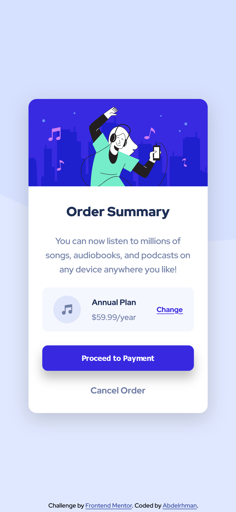

# Frontend Mentor - Order summary card solution

This is a solution to the [Order summary card challenge on Frontend Mentor](https://www.frontendmentor.io/challenges/order-summary-component-QlPmajDUj). Frontend Mentor challenges help you improve your coding skills by building realistic projects.

## Table of contents

- [Overview](#overview)
  - [The challenge](#the-challenge)
  - [Screenshot](#screenshot)
  - [Links](#links)
- [Author](#author)

## Overview

Simple responsive order summary card.

### The challenge

Users should be able to:

- See hover states for interactive elements

### Screenshot

#### Desktop:
  - Desktop 1366px:
  
  
  - Desktop 1440px:
  
  
  

  
 #### Mobile
 - (Live Server):
 
  
 - Iphone13 (Simulation):
 
 

### Links

- Solution URL: [Here](https://your-solution-url.com)
- Live Site URL: [Go Live](https://your-live-site-url.com)

### Built with

- HTML
- CSS (Flexbox & other stuff)

## Author

- Frontend Mentor - [@Sherif-jr](https://www.frontendmentor.io/profile/Sherif-jr)
- Twitter - [@Sherif_Jr_](https://www.twitter.com/Sherif_Jr_)
